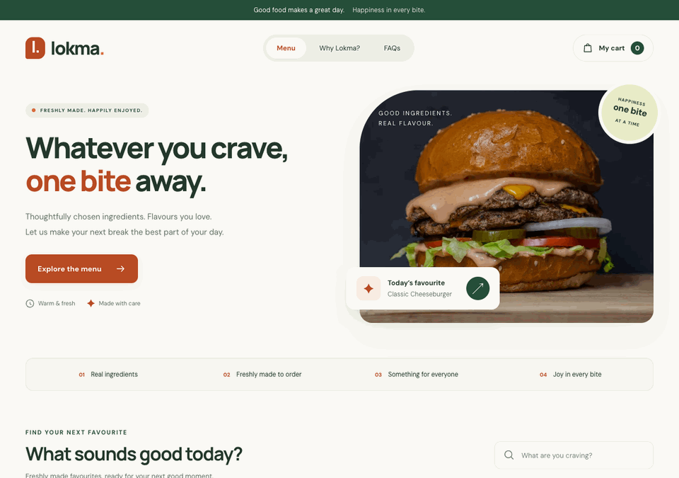

# Lokma — Food Ordering Demo

[](https://github.com/fatmakahveci/react-ts-food-order/actions/workflows/ci.yml)
[](https://react.dev/)
[](https://nextjs.org/)
[](LICENSE.md)

An English-language restaurant demo built with Next.js 16, React 19 and TypeScript 6.
Browse dishes, find a favourite and try the cart and checkout flow on desktop or mobile.

## Demo



This is a frontend demonstration. No payment is taken, no order is sent to a
restaurant and no delivery is arranged. Use fictional details when trying checkout.

## Features

- Six sample dishes with photos, descriptions and preparation estimates.
- Category filters, price sorting and text search with an empty-results state.
- Cart quantities, item removal and automatically calculated totals.
- Delivery form with inline validation, progress steps and demo order confirmation.
- Mobile navigation, in-cart indicators and a floating order summary.
- Responsive layout, labelled controls and reduced-motion support.
- English page metadata and a branded social preview image.

Menu prices are sample amounts in **TRY**, formatted using the English locale.
Cart state stays in memory and resets when the page reloads. The active checkout
does not send or persist the entered details. Food images load from Unsplash and
fonts load from Google Fonts, so those assets require an internet connection.

## Quick Start

Use **Node.js 22.13 or newer within the 22.x release line** and npm to match CI.
The test dependencies require a newer Node.js version than Next.js alone.
No API keys or environment variables are needed for local development.

```bash
git clone https://github.com/fatmakahveci/react-ts-food-order.git
cd react-ts-food-order
npm ci --ignore-scripts
npm run dev
```

Open [localhost:3000](http://localhost:3000).

## Commands

| Command | Purpose |
| --- | --- |
| `npm run dev` | Start the local development server. |
| `npm run lint` | Check source files with ESLint. |
| `npm test` | Run Node.js tests, then Vitest and React Testing Library tests. |
| `npm run build` | Build, check TypeScript and export the static site to `out/`. |

The configured output is a static export. The retained `npm start` script runs
`next start`, which is not the serving path for this export. To preview a production
build with Python 3 installed:

```bash
npm run build
python3 -m http.server 3000 --directory out
```

## Project Structure

```text
src/app/page.tsx         Page layout and ordering coordination
src/app/layout.tsx       Document language and social metadata
src/app/globals.css      Shared styling and responsive layout
src/components/          Menu and cart dialog components
src/data/menu.ts         Typed menu catalogue
src/lib/format.ts        Shared currency and image helpers
src/context/             Cart context and reducer
src/shared/              Shared TypeScript types and constants
public/og.png            Social preview image
docs/assets/demo.gif     README demo recording
tests/                   Metadata, cart and menu tests
.github/workflows/       CI, Pages deployment and source-package publishing
docs/                    Deployment guide
```

The active home page uses `CartProvider` and its own ordering interface.
Menu data lives in `src/data/menu.ts`; filtering and checkout live in
`src/components/menu-section.tsx` and `src/components/cart-dialog.tsx`.

## CI and Deployment

Pull requests targeting `main` run lint, tests and the production build. Successful
pushes to `main` deploy the verified static output to GitHub Pages. Deployment is
skipped for pull requests. Changes to `main` must go through a pull request.

See the [deployment guide](docs/deployment.md) for build variables, Pages setup,
custom-domain troubleshooting and the separate source-package workflow.

## Documentation

- [Deployment guide](docs/deployment.md)
- [Contributing](.github/CONTRIBUTING.md)
- [Changelog](CHANGELOG.md)
- [Security policy](SECURITY.md)
- [Apache 2.0 license](LICENSE.md)
