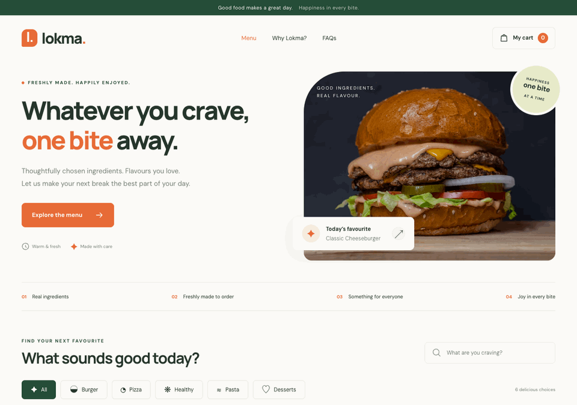

# React Food Ordering Experience

[](https://react.dev/)
[](https://nextjs.org/)
[](https://github.com/fatmakahveci/react-ts-food-order/commits/main)
[](LICENSE.md)

A Next.js food-ordering interface with a typed cart, meal selection, modal checkout flow, and reusable UI components.

## Demo



Browse the menu, filter dishes, update your cart and complete a demo order. No payment is taken and no real order is placed.

## Highlights

- Browse available meals and add configurable quantities
- Review, increment, decrement, and remove cart items
- Context-based cart state and derived totals
- Checkout form and responsive modal interaction

## Technology

- Next.js
- React
- TypeScript
- React Context
- Cypress

## Getting Started

### Prerequisites

- Node.js 20 or newer
- npm

### Installation

```bash
npm install
npm run dev
```

Open http://localhost:3000.

## Quality Checks

```bash
npm run lint
npm test
npm run build
```

## CI / CD

[](https://github.com/fatmakahveci/react-ts-food-order/actions/workflows/test.yml)

Pull requests targeting `main` run ESLint, automated tests and a production build
with TypeScript checks. Pushes to `main` run the same checks, then deploy the
verified `out/` artifact to GitHub Pages. Failed checks prevent deployment.
The workflow can also be started manually from the Actions tab; only `main` deploys.

GitHub Pages uses **Settings → Pages → Build and deployment → GitHub Actions**.
No custom deployment token is required: the deployment job uses the built-in
`GITHUB_TOKEN` with Pages and OIDC permissions. The `github-pages` environment
controls deployment access; pull requests never receive deployment permissions.

The workflow reads the domain and repository path from Pages settings and sets
`NEXT_PUBLIC_BASE_PATH` and `SITE_URL` for the build. Local builds keep the root
path and the existing Sites metadata by default. To reproduce a project-path build:

```bash
NEXT_PUBLIC_BASE_PATH=/react-ts-food-order \
SITE_URL=https://fatmakahveci.github.io/react-ts-food-order npm run build
```

See [GitHub’s Pages workflow documentation](https://docs.github.com/en/pages/getting-started-with-github-pages/using-custom-workflows-with-github-pages)
for environment protection and publishing settings. The existing release workflow
continues to publish source packages to GHCR independently.

## Repository Structure

- `src/app/components/Meals` — meal catalogue and quantity controls
- `src/app/components/Cart` — cart and checkout experience
- `src/app/store` — typed cart context and reducer

## Project Resources

- [Changelog](CHANGELOG.md)
- [Contributing guide](.github/CONTRIBUTING.md)
- [Security policy](SECURITY.md)
- [License](LICENSE.md)
